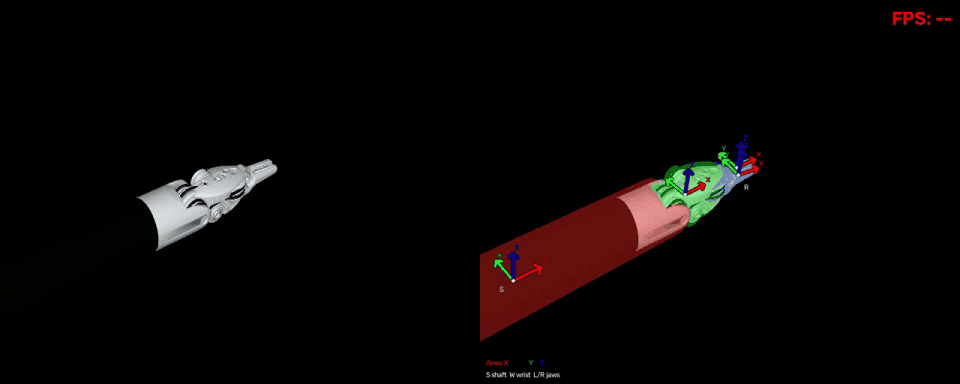

# Endoscopic Instrument Pose Tracking



A 15-second prediction demo: input frames on the left and predicted overlays on the right. The preview retains the full duration of `runs/video_demo/prediction.mp4` at 640 x 256 and approximately 6 FPS, with a 64-color palette (about 665 KiB). The FPS label records the original inference speed, not the GIF playback rate.

The network estimates wrist pose and three joint angles from **six-channel paired masked RGB**: `concat(target RGB * target mask, moving RGB * moving mask)`. Each ResNet-34 stage refines the estimate, and nvdiffrast renders the predicted instrument through forward kinematics.

## Project Layout

```text
instrument-tracking/
|-- training_pose.py          # Training entry point
|-- infer_pose.py             # Image and video inference entry point
|-- create_data.py            # Synthetic data generation entry point
|-- network/
|   |-- poseNet.py            # Pose network and iterative refinement
|   `-- pose_losses.py        # Training losses and evaluation metrics
|-- utils/
|   |-- pose_geometry.py      # Kinematics, camera geometry, and rendering
|   |-- pose_appearance.py    # Mesh materials and appearance
|   |-- pose_data.py          # Datasets and preprocessing
|   |-- pose_tip_labels.py    # Tip extraction, supervision labels, and caches
|   |-- pose_video.py         # Video I/O, motion, and overlays
|   `-- pose_visualization.py # Validation visualizations
|-- scripts/                  # Renderer setup, inspection, and benchmarks
|-- docs/                     # Technical notes and demo assets
|-- README.md
|-- environment.yml
|-- requirements.txt
`-- requirements-renderer-windows.txt
```

The three main entry points run as before. Run auxiliary commands as modules from the project root, for example `python -m scripts.inspect_renderer`, `python -m scripts.benchmark_renderer`, or `python -m utils.pose_tip_labels --help`. Data, run outputs, and project-local build tools keep their existing root-level paths. The local test directory remains excluded from Git.

## Installation with Conda

The setup below uses **Python 3.10 and CUDA 12.6 PyTorch**. The default nvdiffrast renderer requires an NVIDIA GPU, a compatible driver, and CUDA/C++ build tools. CPU-only PyTorch cannot run the default training pipeline. Conda manages the Python environment; install the remaining packages with pip after activation.

```powershell
git clone https://github.com/shenao1995/instrument-tracking.git
cd instrument-tracking
conda env create -f environment.yml
conda activate instrument-tracking
python -m pip install torch==2.12.1 torchvision==0.27.1 --index-url https://download.pytorch.org/whl/cu126
python -m pip install -r requirements.txt
```

This PyTorch/torchvision pair matches the original project environment. These instructions provide an installation baseline; reproduction in a fresh Conda environment has not been verified. For a different CUDA version, adjust both PyTorch and the compiler toolkit using the [official PyTorch installation commands](https://pytorch.org/get-started/previous-versions/).

### Differentiable renderer

**Windows:** the setup script downloads project-local CUDA 12.6, MSVC, and Windows SDK tools into the Git-ignored `.tools/` and `.reference/` directories. Run it from the activated Conda environment:

```powershell
python -m pip install -r requirements-renderer-windows.txt
# Detect the current GPU architecture. Set a semicolon-separated list for multiple architectures.
$env:TORCH_CUDA_ARCH_LIST = python -c "import torch; print('.'.join(map(str, torch.cuda.get_device_capability())))"
python -m scripts.setup_nvdiffrast_windows
```

**Linux, or Windows with an existing CUDA/C++ toolchain:** install a CUDA Toolkit containing nvcc that matches the PyTorch CUDA version. Windows also requires MSVC C++ Build Tools and the Windows SDK. Then install the pinned renderer revision:

```text
python -m pip install setuptools wheel ninja
python -m pip install git+https://github.com/NVlabs/nvdiffrast.git@253ac4fcea7de5f396371124af597e6cc957bfae --no-build-isolation
```

See the [nvdiffrast documentation](https://nvlabs.github.io/nvdiffrast/) for platform requirements. Check the installation with:

```powershell
python -c "import torch, torchvision, nvdiffrast.torch; print('PyTorch:', torch.__version__, 'CUDA:', torch.version.cuda, 'GPU available:', torch.cuda.is_available())"
```

### Dependencies

| Packages | Purpose |
| --- | --- |
| `torch`, `torchvision` | Neural network and training |
| `numpy`, `scipy` | Numerical operations and tip processing |
| `Pillow`, `opencv-python` | Images and video |
| `trimesh`, `fast-simplification` | Mesh loading and simplification |
| `matplotlib` | Visualization |
| `tensorboard` | Training logs |
| `nvdiffrast` | Differentiable rendering |
| `pytest` | Development tests; the local test suite is excluded from this repository |

Version requirements are listed in [requirements.txt](requirements.txt). Windows build helpers are listed separately in [requirements-renderer-windows.txt](requirements-renderer-windows.txt).

## Data Preparation

The repository excludes `data/`, `runs/`, `tests/`, local environments, caches, and trained weights. Only the compressed preview is included in `docs/assets/`; the source MP4 is excluded.

Prepare these assets before running the examples:

- `data/instrument_mesh/`: `transformed_shaft.obj`, `transformed_wrist.obj`, `transformed_gripper_left.obj`, and `transformed_gripper_right.obj`, with their corresponding MTL material files.
- `data/surgpose_sample/transforms.json`: camera calibration and initial pose. Real-image inference also requires the `color/` and `l_mask/` directories.
- Synthetic training data generated with `create_data.py`, followed by weights trained with `training_pose.py`. Supply a local checkpoint to inference using `--checkpoint`.

Use `--mesh-dir`, `--calibration`, and the relevant data arguments to override default paths. The experiment paths and historical validation records below illustrate the workflow; their datasets and checkpoints are not bundled.

## Data Generation, Training, and TensorBoard

Run all commands from the project root with the Conda environment activated. Start with a small sample count to inspect appearance and visibility before generating the full dataset.

```powershell
conda activate instrument-tracking

python create_data.py --output data/synthetic_rgb_pose --num-samples 10000 --height 512 --width 640 --batch-size 4 --supersample 1

python training_pose.py --data data/synthetic_rgb_pose --output runs/pose_rgb --epochs 50 --batch-size 4 --steps 2 --amp --pretrained --val-every 2 --rgb-weight 0.1 --mask-weight 1 --tips-weight 1 --tips-position-weight 1 --tips-gap-weight 1

python -m tensorboard.main --logdir runs/pose_rgb/tensorboard --port 6006
```

Image dimensions come from the dataset metadata. The example above produces network inputs of shape `[B, 6, 512, 640]`. Training builds `tip_labels_v2.npz/.json` caches from masks and geometric tips without modifying the original samples. Datasets generated with the version 4 material renderer can be reused; older datasets with randomly colored RGB need regeneration.

Open `http://localhost:6006`. Under SCALARS, inspect `train_batch`, `train_epoch`, and `val`. Under IMAGES, inspect `val/overlap_GT_left_prediction_right` and `val/RGB_target_left_render_right`.

Use `--save-best-by mean_dice` to select checkpoints by Dice. When resuming, preserve the original total epoch count, refinement stages, loss weights, validation schedule, and checkpoint selection policy:

```powershell
python training_pose.py --data data/synthetic_rgb_pose --output runs/pose_rgb --resume runs/pose_rgb/last.pt --epochs 50 --batch-size 4 --steps 2 --amp
python infer_pose.py --checkpoint runs/pose_rgb/best.pt --output runs/pose_rgb/test --track --amp
```

Use `--init-from <checkpoint>` with a new output directory when transferring six-channel RGB weights between experiments with changed objectives. This resets the optimizer, scheduler, and best score. Reserve `--resume` for an exact continuation with the same configuration. Legacy nine-channel checkpoints cannot initialize the RGB model, although `infer_pose.py` still supports their original mask-pair inference path. RGB checkpoints require target RGB and do not support `--mask-only`.

Real samples in `data/surgpose_sample/color` and `l_mask` are used for evaluation. `transforms.json` provides camera intrinsics and initialization; repeated matrices are not per-frame pose ground truth. Synthetic-only training leaves an appearance domain gap, so real-world pose accuracy requires separate evaluation.

## Validation Visualization

```powershell
python infer_pose.py --checkpoint runs/pose_rgb/best.pt --split val --output runs/pose_rgb/validation
```

`--split val` resolves the synthetic dataset from the checkpoint configuration and reads only validation entries in the manifest, using their stored initialization, intrinsics, and labels. Override the location with `--data data/synthetic_rgb_pose`. Explicitly selecting a manifest-based dataset without `--split` also selects validation automatically.

All validation samples are processed by default; add `--limit 20` for a preview. Tip-cache checks honor the selected samples and limit. Validation samples are independent, so `--track` and `--reset-every` are unavailable. Output names preserve original sample IDs rather than the number of processed samples.

| Output | Contents |
| --- | --- |
| `overlays/<sample>.png` | Ground-truth overlay on the left, prediction on the right; GT tips and connecting lines are yellow, predictions pink, invalid GT tips gray |
| `rgb_pairs/<sample>.png` | Target masked RGB and predicted rendered RGB for RGB checkpoints |
| `masks/<sample>.png` | Predicted semantic masks encoded as 0/10/20/30 |
| `poses.jsonl` | Per-sample poses, Dice, IoU, predicted/GT tips, and valid tip-gap errors |
| `metrics.json` | Validation Dice/IoU, valid tip-pair ratio, tip-gap MAE in pixels, and timing |

Missing tips are not counted as zero error. These metrics do not measure 3D pose accuracy. With 512 x 640 input images, each side-by-side overlay or RGB comparison is 512 x 1280. Standalone inference does not require TensorBoard. Without an explicit dataset or split, inference defaults to `data/surgpose_sample`.

## Continuous Video Generation and Inference

```powershell
conda activate instrument-tracking

# Generate 15 seconds at 30 FPS: 450 frames.
python create_data.py --video --output data/continuous_video_15s --duration 15 --fps 30 --height 512 --width 640 --supersample 1 --min-depth 0.10 --max-depth 0.15

# Video inference uses the previous prediction to initialize the next frame by default.
python infer_pose.py --checkpoint runs/pose_rgb/best.pt --video data/continuous_video_15s/video.mp4 --output runs/pose_rgb/video_15s
```

Use an empty output directory. Video generation uses continuous sinusoidal trajectories for translation, rotation, wrist articulation, and gripper motion, independently of the rendering batch size. The number of frames is `round(duration * fps)`. `--motion-rotation` controls the video orientation amplitude (5 degrees by default); `--rotation-range` applies only to random training samples.

Generated files:

- `video.mp4`: material RGB renderings on a black background using MP4V encoding; these do not simulate real endoscopic backgrounds or lighting.
- `masks/frame_000000.png`, etc.: synchronized, lossless semantic masks with labels 0/10/20/30.
- `video_metadata.json`: FPS, dimensions, frame count, intrinsics, fixed initial pose, mesh hashes, and rendering settings.
- `poses_gt.jsonl`: per-frame timestamps, ground-truth poses, and projected tips for checking motion continuity. Inference does not read these per-frame ground-truth poses.

Inference writes `prediction.mp4`, with the original frame on the left and the predicted semantic overlay on the right. It preserves the input frame rate and writes every processed frame, including empty-mask frames, which reset tracking initialization. `poses.jsonl` stores per-frame predictions; `metrics.json` records performance and Dice.

Useful options:

| Option | Behavior |
| --- | --- |
| `--independent-frames` | Disable initialization from the previous prediction |
| `--reset-every N` | Periodically reset to the fixed initial pose |
| `--limit N` | Process at most N frames |
| `--axis-length-mm 6` | Set displayed axis length; default: 4 mm |
| `--no-part-axes` | Hide local part axes |
| `--fps-window 10` | Change the rolling performance window; default: 30 completed frames |

The overlay shows local axes for `S` (shaft), `W` (wrist), `L` (left gripper), and `R` (right gripper), with X red, Y green, and Z blue. Directions come from predicted forward kinematics in the aligned canonical part frames. Display origins are shifted inside each part and are not physical joint pivots. Perspective projection can shorten axes pointing toward the camera; diagnostic axes may appear in occluded regions.

```powershell
python infer_pose.py --checkpoint runs/pose_rgb/best.pt --video data/video_demo/video.mp4 --output runs/video_demo_axes --axis-length-mm 4
```

Inference automatically loads adjacent `<video_stem>_metadata.json` and corresponding masks. For external videos, provide `--mask-dir` with naturally sorted masks aligned to decoded frames, plus `--calibration`; `--video-metadata` can specify metadata explicitly. The network does not include a segmentation model and cannot replace semantic masks with unsegmented RGB alone.

### Performance Measurements

The red FPS label uses completed frames from the rolling window, including decoding, mask reads, preprocessing, GPU transfers, network execution, all rendering, Dice, overlays, video encoding, and JSON writes. To account for encoding time, each frame displays statistics through the preceding frame; the first frame shows `FPS: --`. `poses.jsonl` records this value as `display_fps`.

`metrics.json` distinguishes:

- `pipeline_fps`: network execution and initial/intermediate/final rendering, with GPU synchronization.
- `end_to_end_fps`: decoding, precomputed mask reads, preprocessing, transfers, inference, Dice, overlays, encoding, and JSON output, excluding model loading and warm-up. Final encoder closure is included here but excluded from the on-screen rolling FPS.

Metrics also include full-processing P95 latency, the source frame-time budget, and the fraction of frames completed within budget. Segmentation-model time is excluded. Playback at 30 FPS does not establish 30 FPS processing or real-world pose accuracy.

## Kinematic and Semantic Conventions

The output `R, t` transforms wrist coordinates into the OpenCV camera frame: +x right, +y down, and +z forward. Translation is measured in meters and angles in radians. Joint order is `alpha, theta_left, theta_right`.

Rotation uses a continuous 6D representation followed by orthogonalization. Translation is constrained to x/y within +/-0.08 m and z within 0.025-0.22 m. The wrist angle is limited to +/-90 degrees; each gripper angle to +/-80 degrees, with a nonnegative sum.

```text
T_shaft_camera = T_wrist_camera * inverse(T_wrist_shaft(alpha))
T_left_camera  = T_wrist_camera * Translate(0.009, 0, 0) * Rz(theta_left)
T_right_camera = T_wrist_camera * Translate(0.009, 0, 0) * Rz(-theta_right)
```

These conventions follow the [Instrument-Splatting kinematics](https://github.com/jinlab-imvr/Instrument-Splatting/blob/ac56d1b407734817b44f589cf5d0778837a65e9d/utils/instrument.py). Semantic labels 0/10/20/30 represent background, shaft, wrist, and merged grippers. The two grippers move independently, but the shared label does not support separate left/right Dice scores.

## Diagnostics and Reference Notes

`scripts/inspect_renderer.py` and `scripts/benchmark_renderer.py` inspect mask rendering by default. Inspect generated `preview/*_rgb.png` files and validation visualizations for RGB appearance. The Windows setup script records download sources and hashes in `.tools/provenance.json` without modifying the global driver or PATH.

Historical technical notes are retained in their original language:

- [Renderer research](docs/RENDERER_RESEARCH.md)
- [Tip supervision and validation](docs/TIP_SUPERVISION.md)
- [Historical RGB training validation](docs/RGB_TRAINING_VALIDATION.md)
- [Historical mask validation](docs/VALIDATION.md)
- [Video validation](docs/VIDEO_VALIDATION.md)

A local development copy containing `tests/` can run `python -m pytest -q`. The test directory is excluded from this repository.
